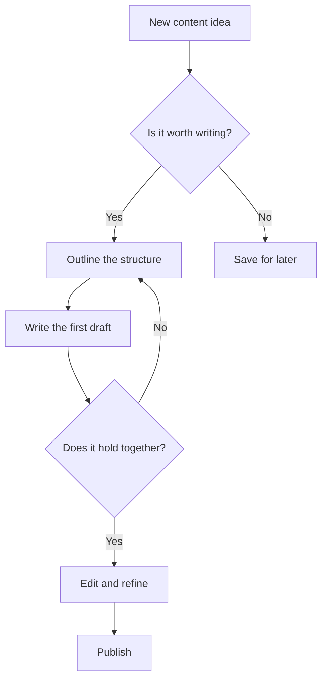
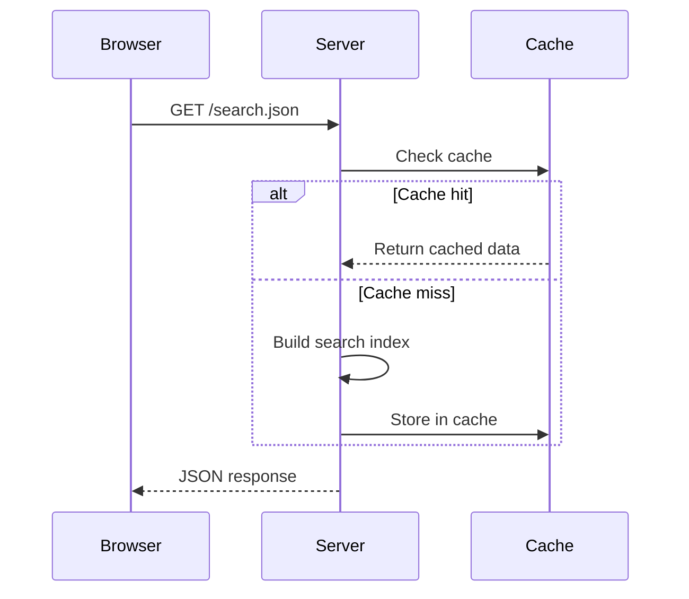

import LiteYouTube from "../../../components/LiteYouTube.astro";
import Table from "../../../components/Table.astro";
import Figure from "../../../components/Figure.astro";

Writing well on the web is not about using every tool available. It is about choosing the right element for the moment — the one that makes your reader's life easier, not the one that makes you feel clever. This guide walks through every content element this blog supports, but more importantly, it tries to explain *when* each one belongs.

## Prose Comes First

The foundation of any good post is the paragraph. Serif type at a relaxed line-height, wrapped to a comfortable measure — these are not aesthetic choices but functional ones. Readers scanning a wall of text will leave. Readers given room to breathe will stay.

**Bold text** should be rare. When everything is emphasised, nothing is. Reserve it for the single phrase in a paragraph that you want a skimming reader to catch. *Italics* serve a different purpose: tone, attribution, or the gentle aside that colours a sentence without shouting. And `inline code` is for technical terms — function names like `useEffect`, shell commands like `git rebase`, file paths like `tsconfig.json` — anything the reader might type verbatim.

### Headings as Signposts

Headings are not decoration. They are a contract with the reader: *if you care about this topic, read on; if not, skip ahead*. The table of contents on the right is generated automatically from your headings, so choose them carefully. A heading like "Miscellaneous" is a confession that you haven't thought hard enough about structure.

Use `##` for major sections and `###` for subsections within them. That is usually enough. If you find yourself reaching for `####`, consider whether you actually need another heading or whether a bold lead-in sentence would serve better.

## Quotations

A well-placed quotation can do what a paragraph of argument cannot. It brings another voice into the room:

> "The act of writing is the act of discovering what you believe."
>
> <cite>David Hare</cite>

Use blockquotes for ideas that deserve to stand apart — a principle you are building on, a counterpoint you want the reader to sit with. Do not use them for emphasis or as a substitute for your own thinking. If you find yourself quoting more than writing, step back and ask what *you* have to say.

## Lists

Not everything belongs in a list. If your points follow a logical sequence where each builds on the last, write them as prose. Lists are for items that are genuinely parallel — steps, options, features — where the reader benefits from scanning.

Unordered lists work well for collections where order does not matter:

- Each item should be roughly the same level of abstraction
- Keep items short — if an item needs multiple sentences, it probably wants to be a paragraph
- Three to seven items is the sweet spot; beyond that, consider grouping

Ordered lists earn their place when sequence matters:

1. Diagnose the problem before proposing a solution
2. Write the simplest fix that addresses the root cause
3. Verify the fix does not introduce new problems
4. Document what you changed and why

### Task Lists

Task lists are checkboxes. They are useful for tracking progress in a living document — a project plan, a review checklist, a migration tracker:

- [x] Define the content schema
- [x] Build the rendering pipeline
- [x] Style every content element
- [ ] Write the guide you are reading now
- [ ] Ship it

They lose their purpose in a published essay. If your checklist is not something the reader will come back to and mentally tick off, a regular list is better.

## Code

Code blocks are among the most important elements in a technical blog. They carry the weight of *proof* — showing, not just telling, how something works. Every block gets syntax highlighting, a language label, and a copy button automatically.

A short, focused example teaches more than a long one:

```typescript
function clamp(value: number, min: number, max: number): number {
  return Math.min(Math.max(value, min), max);
}
```

When you need to show more context — a complete module, a configuration file, a meaningful algorithm — let the code breathe. Comments should explain *why*, not *what*:

```python
def retry(fn, attempts=3, backoff=1.0):
    """Retry a function with exponential backoff.

    Useful for network calls where transient failures are expected.
    The backoff doubles after each attempt to avoid thundering herd.
    """
    for attempt in range(attempts):
        try:
            return fn()
        except Exception:
            if attempt == attempts - 1:
                raise
            time.sleep(backoff * (2 ** attempt))
```

Choose the language that best illustrates your point. If you are explaining a concept, use the language your audience knows. If you are documenting a specific tool, use its native language. Here is a shell session showing a practical workflow:

```bash
# Create a new branch, make changes, and push
git checkout -b feat/search-modal
git add src/components/SearchModal.astro
git commit -m "feat: add keyboard-driven search modal"
git push -u origin feat/search-modal
```

And a configuration file to show how JSON blocks render:

```json
{
  "compilerOptions": {
    "target": "ESNext",
    "module": "ESNext",
    "strict": true,
    "jsx": "preserve"
  }
}
```

Inline references like `bun run build` or `Array.prototype.flatMap()` should appear naturally in your sentences, not as standalone fragments.

## Images

A good image earns its place by showing something words cannot efficiently describe — architecture, UI state, visual output, the physical world. Every image needs alt text (for accessibility) and benefits from a caption (for context).

<Figure
  src="https://images.unsplash.com/photo-1506905925346-21bda4d32df4?w=800&h=400&fit=crop&q=80"
  alt="A dramatic mountain landscape at golden hour, with layered peaks fading into warm orange haze"
  width={800}
  height={400}
  label="Figure 1."
  caption="The best photographs, like the best writing, leave room for the viewer to fill in meaning. Photo by Samuel Ferrara on Unsplash."
/>

Click any image to open the lightbox for a closer look. This happens automatically — you don't need to do anything special in your markup.

Avoid decorative images that do not advance the reader's understanding. If a screenshot of your terminal would help the reader follow along, include it. If a stock photo of a laptop exists only to "break up the text", leave it out.

## Tables

Tables are the right choice when you have structured data with multiple attributes per item. They are the wrong choice for everything else. If you only have two columns and one of them is a label, consider a definition list instead.

<Table label="Table 1." caption="When to use each content element — a rough decision matrix.">
| Element | Best for | Avoid when |
| :--- | :--- | :--- |
| Paragraph | Explanation, narrative, argument | Data that needs scanning |
| List | Parallel items, steps, options | Items that need context |
| Table | Multi-attribute comparisons | Only two columns |
| Code block | Exact syntax, algorithms | Pseudocode that changes often |
| Blockquote | External voices, key principles | Self-emphasis |
| Diagram | Flows, relationships, processes | Simple sequences |
</Table>

Tables scroll horizontally on small screens, so they remain usable even with several columns. Keep cell content concise — if a cell needs a paragraph, the data probably belongs in prose with the table serving as a summary.

## Diagrams

Sometimes a visual relationship is clearer than a written one. Mermaid diagrams render directly from code blocks — no image files to maintain, no external tools to learn. They automatically match the current theme.

A flowchart is useful when you want to show a decision process:



A sequence diagram works well for showing interactions over time:



Use diagrams when the *relationships* between things matter more than the things themselves. If you are just listing steps in order, a numbered list is simpler and easier to maintain.

## Video

Video embeds load lazily — only a thumbnail appears until the reader clicks play. This keeps pages fast while still offering rich media when it matters.

<LiteYouTube videoid="PkZNo7MFNFg" title="Learn JavaScript - Full Course for Beginners" />

Embed a video when it teaches something that text and images cannot — a live demo, a talk, a visual walkthrough. Do not embed a video as a substitute for writing. If the content of the video can be summarised in a paragraph, write the paragraph.

## Collapsible Sections

Collapsible sections hide content behind a click. They are useful for supplementary material that some readers want and others do not — configuration details, FAQ answers, extended examples.

<details>
<summary>When should you use a collapsible section?</summary>

The rule of thumb is: if removing this content entirely would not hurt the main narrative, but keeping it helps some readers, wrap it in a collapsible. Good candidates include:

- **Extended examples** that go deeper than the main text requires
- **Configuration references** that only matter to someone actively implementing
- **Troubleshooting steps** for edge cases most readers will not encounter
- **Historical context** that enriches but is not essential

Bad candidates include anything the reader *needs* to understand your point. If it is important, do not hide it.

</details>

<details>
<summary>How do collapsible sections render?</summary>

They use the native HTML `<details>` and `<summary>` elements, styled to match the design system. The `+` icon rotates on open, and content fades in smoothly. You can put any content inside — paragraphs, lists, code blocks — and it will render correctly.

```html
<details>
<summary>Your heading here</summary>

Your content here. Leave a blank line after the summary tag.

</details>
```

</details>

## Footnotes

Footnotes serve a specific purpose: they let you make a claim in the main text without cluttering it with the evidence[^1]. Academic and research-oriented writing benefits most from footnotes. Casual posts rarely need them.

The key discipline is this: the main text should make complete sense without the footnotes. They are supplements, not crutches. If a footnote contains information the reader *must* know to follow your argument, it belongs in the body[^2].

You can use footnotes for attribution, tangential observations, or links to further reading that would interrupt the flow of a sentence[^3].

[^1]: Footnotes appear at the bottom of the post, numbered automatically. Click the number to jump down; click the arrow to jump back.

[^2]: A useful test: read your post aloud, skipping the footnotes. If it still makes sense, you have used them well.

[^3]: For example, Edward Tufte's *The Visual Display of Quantitative Information* has influenced this blog's approach to data presentation, but that reference would derail a sentence about footnote mechanics.

## Definition Lists

Definition lists are the overlooked middle ground between a paragraph and a table. When you need to explain a set of terms — glossary entries, API parameters, configuration options — a definition list pairs each term with its meaning cleanly.

<dl>
  <dt>Prose</dt>
  <dd>The default. Continuous text in paragraphs, the way most ideas are best expressed.</dd>

  <dt>Figure</dt>
  <dd>An image with a caption. Use when visual evidence advances the argument.</dd>

  <dt>Table</dt>
  <dd>Structured data in rows and columns. Use when readers need to compare multiple attributes across items.</dd>

  <dt>Diagram</dt>
  <dd>A rendered Mermaid chart. Use when relationships or flow matter more than individual details.</dd>
</dl>

If your definitions are longer than a sentence or two each, consider whether full paragraphs with bold lead-ins would read better.

## Putting It All Together

Good writing is not about using every element on this page. It is about restraint — choosing the element that serves the reader in each moment and resisting the temptation to use a fancier one when a simpler one will do.

A few principles worth keeping:

1. **Start with prose.** If you can say it in a paragraph, say it in a paragraph
2. **Earn every element.** A code block should prove something. A diagram should clarify a relationship. A table should enable comparison. If the element is not doing work, remove it
3. **Respect the reader's time.** Collapsible sections, footnotes, and definition lists exist so that different readers can go as deep as they choose
4. **Let the design system help.** Typography, spacing, and colour are already tuned for readability. Your job is to provide the structure; the styles will handle the rest

The best posts on this blog will not be the ones that use the most elements. They will be the ones where every element feels inevitable — where the reader never pauses to wonder *why is this a table?* or *why is this in a code block?* because the answer is obvious.

Write clearly. Choose deliberately. Ship it.
